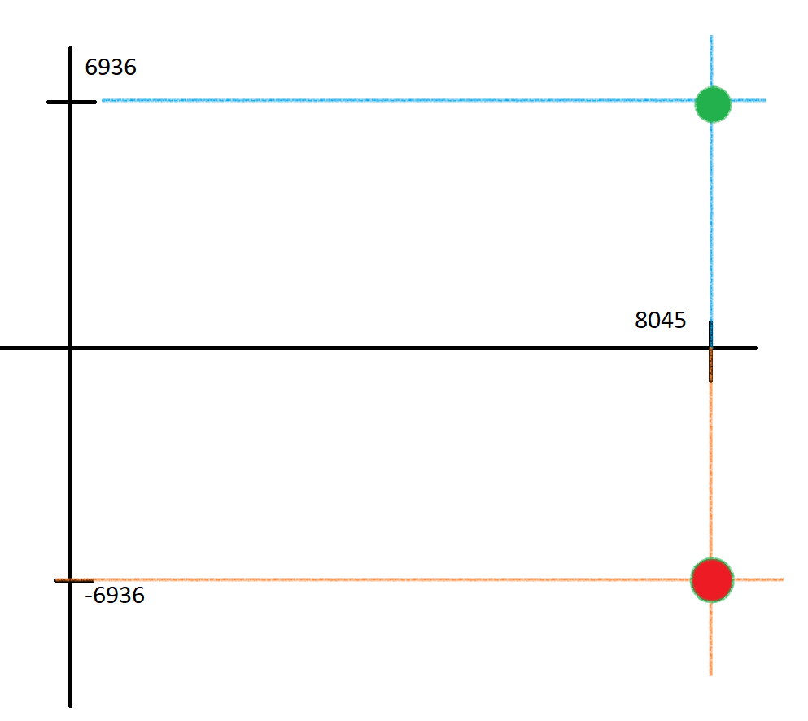

# Point Negation
Question:
```text
E: Y2 = X3 + 497 X + 1768, p: 9739
```
`Using the above curve, and the point P(8045,6936), find the point Q(x,y) such that P + Q = O.`

## Solution (Explanation):
P + (-P) = O
Since P(8045,6936), the negation of P will be a reflection on x-axis -P (8045, -6936).



Since we are working on Finite field numbers, we need to modulo the numbers with the given p.

Therefore, Q(8045, -6936 mod 9739) => Q(8045, 2803)

