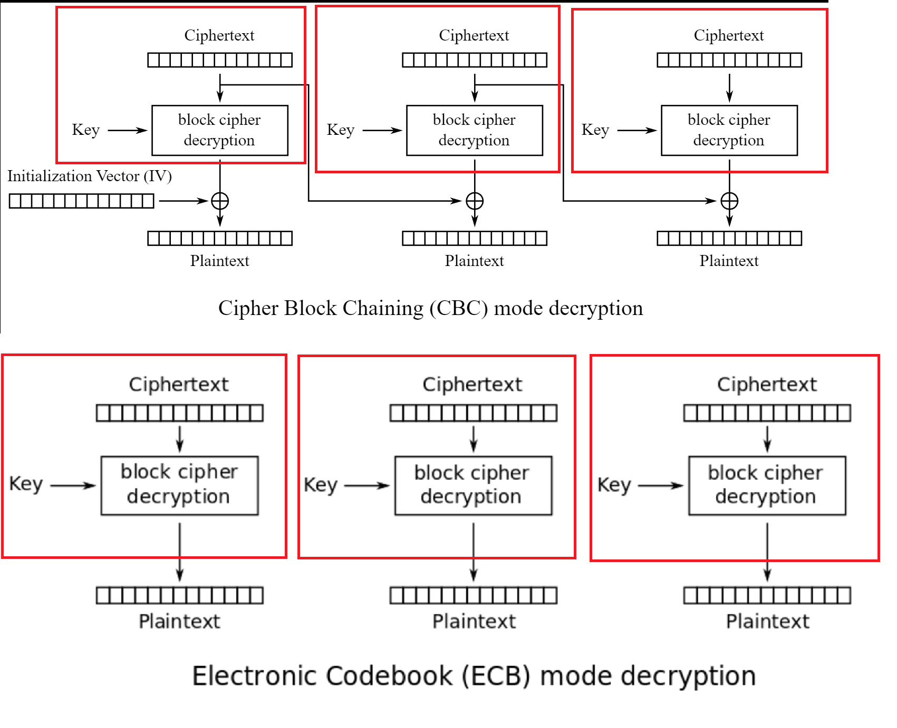

# Encryption mode is different from Decryption mode
Reference: https://aes.cryptohack.org/ecbcbcwtf/

In the exercise, the AES encryption is using CBC mode while the AES decryption is using ECB mode.

> How do we transform a ECB decryption into a CBC decryption?

Looking at the comparison between ECB and CBC, we can see some similarities: 
- The Ciphertext blocks will first be decrypted with the `Key`.
- Look at the red marked boxes.

Since we know the IV, we can use the ECB decryption values and transform the steps into CBC decryption.

### How?
- Split the ciphertexts into blocks based on the given block size.
- First step of CBC: 
  - Decrypt second block (of ciphertext)
  - XOR decrypted_second_block with the first block (IV).
- Second step of CBC: 
  - Decrypt the third block (of ciphertext)
  - XOR decrypted_third_block with the second block (of ciphertext)
- Now the result of the first and second XOR will be the plaintext (a.k.a `FLAG`)